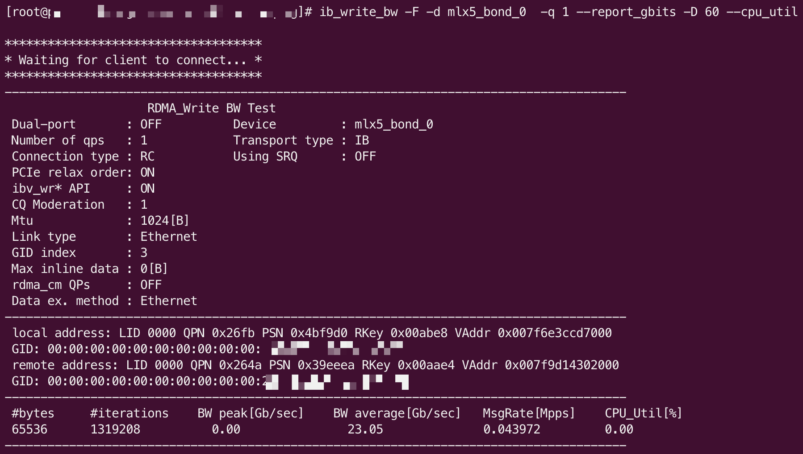
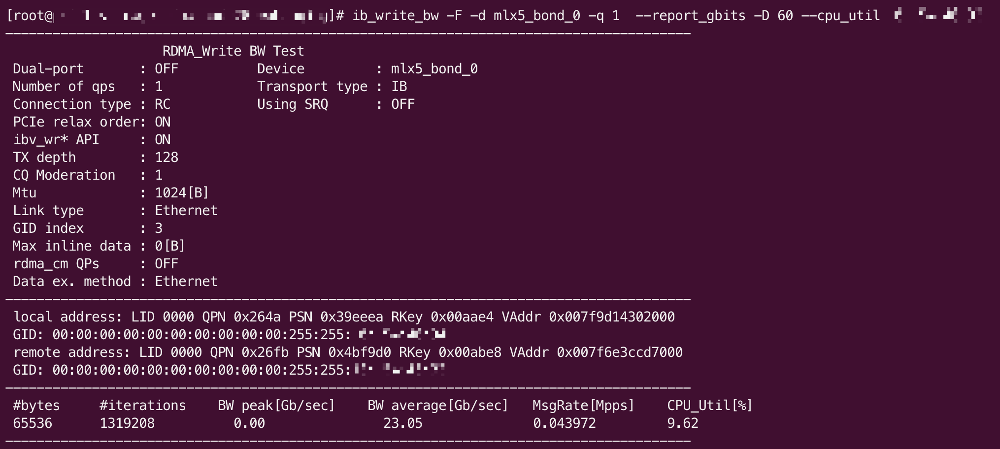
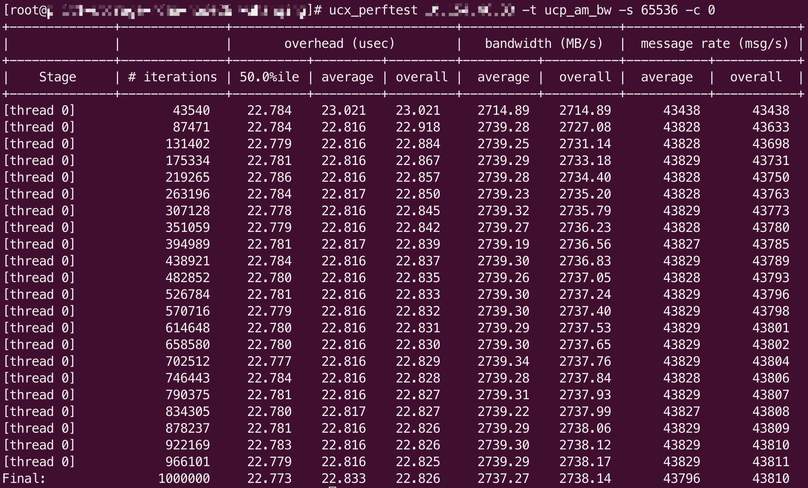

# CurveBS RDMA+SPDK 版本部署

## 系统环境

至少 3 台机器作为存储节点，相关配置参考如下

- CentOS 7.9
- Linux 5.4.247-1.el7.elrepo.x86_64 x86_64
- Mellanox CX4/CX5 网卡，交换机需要支持设置 ECN
- NVMe 盘（每个盘至少占用 2 个 CPU）

至少 1 台机器作为客户端节点，相关配置参考如下

- CentOS 7.9
- Linux 5.4.247-1.el7.elrepo.x86_64 x86_64
- Mellanox CX4/CX5 网卡，交换机需要支持设置 ECN

> TIPS:
> - Debian 11 环境同样支持，MLNX-OFED 驱动安装参考 [Installation](https://docs.nvidia.com/networking/display/MLNXOFEDv582030LTS/Installation)
> - 如果没有单独的客户端节点，可以复用存储节点，但对性能测试可能略有影响

## 配置

### 开启 IOMMU

修改 /etc/default/grub，在 GRUB_COMMAND_LINE 最后加入 `intel_iommu=on`，然后执行 `grub2-mkconfig -o /boot/grub2/grub.cfg` 并重启机器。

### 调整 memlock 限制

SPDK 和 UCX 都会依赖 memlcok，需要进行调整，在 /etc/security/limits.conf 文件中添加如下内容

```
*     hard   memlock           unlimited
*     soft   memlock           unlimited
```

### 安装 OFED 驱动

1. OFED 驱动需要编译安装，默认 GCC4.8.5 会出现编译报错，通过 devtoolset 安装 GCC10
   
   ```bash
   $ yum install centos-release-scl -y
   $ yum install devtoolset-10 -y
   $ scl enable devtoolset-10 bash
   ```
2. 安装依赖包
   
   ```bash
   $ yum install libibverbs-utils perftest createrepo tcl gcc-gfortran fuse-libs tk
   $ yum --enablerepo=elrepo-kernel install -y kernel-lt-devel.x86_64   # kernel-devel的版本要跟实际的内核版本保持一致，如果已经安装可以省略（该命令跟内核版本有关，实际命令可能有所不同）
   ```
3. 安装 OFED 驱动
   
   1. 下载包 https://www.mellanox.com/page/mlnx_ofed_eula?mtag=linux_sw_drivers&mrequest=downloads&mtype=ofed&mver=MLNX_OFED-5.8-2.0.3.0&mname=MLNX_OFED_LINUX-5.8-2.0.3.0-rhel7.9-x86_64.tgz
   
   2. 解压后执行 `./mlnxofedinstall --add-kernel-support`
      
      这个过程会下载一些包和依赖，并且编译安装，中途可能会报错，根据报错安装相应的包。

   3. 完成后执行如下命令

      ```bash
      $ dract -f
      $ /etc/init.d/openibd restart
      $ reboot   # 重启机器
      ```

   4. 验证网络

      1. IB 测试

         服务端命令 `ib_write_bw -F -d mlx5_bond_0 -q 1 --report_gbits -D 60 --cpu_util`

         客户端命令 `ib_write_bw -F -d mlx5_bond_0 -q 1 --report_gbits -D 60 --cpu_util <Server IP Address>`

         命令中 -d 后面的参数需要替换为 `ibv_devinfo` 命令输出中的 `hca_id`

         测试输出结果示例（服务端）：
        
         

         测试输出结果示例（客户端）：
        
         

      2. 执行 `ucx_info -d | grep "Trans"`，输出中需要包含 rc_mlx5/ud_mlx5 或者 rc_verbs/uc_verbs

      3. 保存如下配置到 ${HOME}/ucx.conf

         ```
         [global]
         UCX_TLS=ib
         UCX_USE_MT_MUTEX=y
         UCX_RNDV_THRESH=32K
         UCX_TCP_CM_REUSEADDR=y
         UCX_RDMA_CM_REUSEADDR=y
         UCX_ASYNC_MAX_EVENTS=10000
         UCX_RC_VERBS_MAX_NUM_EPS=10000
         UCX_RC_MLX5_MAX_NUM_EPS=10000
         UCX_RCACHE_STAT_MAX=10M

         UCX_NET_DEVICES=mlx5_bond_0:1
         #UCX_IB_GID_INDEX=3
         UCX_RC_MLX5_TRAFFIC_CLASS=96
         UCX_RC_VERBS_TRAFFIC_CLASS=96

         UCX_RC_VERBS_TX_QUEUE_LEN=512
         UCX_RC_MLX5_TX_QUEUE_LEN=512
         UCX_TCP_MAX_IOV=128
         UCX_LOG_LEVEL=WARN
         #UCX_MAX_RNDV_RAILS=2
         #UCX_MAX_EAGER_RAILS=2
         ```

         其中，UCX_NET_DEVICES 还是需要用 `ibv_devinfo` 的输出替换，分别为 `hca_id` 和 `port`

      4. ucx_perftest 测试

         服务端命令 `ucx_perftest -c 0`

         客户端命令 `ucx_perftest <Server IP Address> -t ucp_am_bw -c 0 -s 65536`

         测试输出结果示例（服务端）：

         

         测试输出结果示例（客户端）：

         

## 部署 Curve

参考 CurveAdm 部署文档 [服务端](https://github.com/opencurve/curveadm/wiki/curvebs-cluster-deployment) [客户端](https://github.com/opencurve/curveadm/wiki/curvebs-client-deployment)，**请提前熟悉相应的操作和流程**，特殊步骤或配置在下面备注。

### CurveAdm 版本

更新到指定版本 `CURVEADM_VERSION=vrdma-rc2 curveadm -u`

### 镜像

opencurvedocker/curvebs_rdma_spdk:1.2-netease，**格式化和部署，都使用这个镜像**

> TIPS: 由于镜像较大，需提前在存储节点和客户端节点上把镜像拉下来 `docker pull opencurvedocker/curvebs_rdma_spdk:1.2-netease`

### 格式化磁盘

由于 SPDK 版本的限制，目前格式化比例最高只能设置到 75%（第一次部署可以先格式化 10% 或者 20%，确认是否能正常部署集群）

格式化命令：`curveadm format --spdk -f format.yaml` ，注意其中的 `—-spdk` 参数

> TIPS:
> - SPDK 格式化的过程会绑定 NVMe 到 VFIO 驱动，导致 lsblk 无法看到 NVMe 盘
> - SPDK 格式化暂时不支持查看进度，需要到存储节点上查看格式化进程是否退出 `ps aux | grep format`（或格式化的容器是否退出）

### 集群拓扑文件

在 chunkserver services 中添加如下字段

```yaml
chunkserver_services:
  config:
    listen.ucp_port: 92${format_replicas_sequence}  # 9200,9201,9202
    use_ucp: true
    use_spdk: true
```

### 部署集群

1. 把配置过程中使用到的 ucx.conf 文件复制到当前目录（执行 curveadm 命令的目录）

2. `curveadm deploy -k`，如果不需要快照克隆服务可以加上 `--skip snapshotclone`

### 查看集群状态

进入其中一个 MDS 容器，`curveadm enter ${Id}`，然后执行 `curve_ops_tool copysets-status`

如下输出表示正常

```
Copysets are healthy!
total copysets: 400, unhealthy copysets: 0, unhealthy_ratio: 0%
```

> TIPS: 如果没有部署快照克隆服务，命令有可能会报错，需要修改容器内的 /etc/curve/tools.conf 配置文件
>
> 修改如下两个配置项：
>
>   snapshotCloneAddr=127.0.0.1:5555
>
>   snapshotCloneDummyPort=5556

### 挂载 NBD 盘

参考客户端部署文档，同样需要把 ucx.conf 放到当前目录

挂载成功后，登录到客户端机器上，lsblk 可以看到对应的 nbd 设备，可以执行 fio 测试，参考命令

```bash
fio -name=/dev/nbd0 -direct=1 -iodepth=128 -rw=randwrite -ioengine=libaio -bs=4k -size=10G -numjobs=1 -time_based -runtime=120
```

## 其他

### 性能测试

- 至少需要 100G 的卷才能测试出比较真实的性能

- 大 IO 顺序读写测试需要创建条带卷，curveadm map 不支持创建条带卷，需要到其中一个 MDS 容器中执行命令创建

  - 参考命令 `curve_ops_tool create -fileName=/test -userName=curve -fileLength=200 -stripeUnit=32768 -stripeCount=32`

  - curveadm map 命令去掉自动创建卷的参数

  - 在大 IO 读的测试中，可能会出现性能很低或抖动明显的情况，这种情况需要在物理机和交换机上进行 RDMA 拥塞控制调整（具体步骤略微繁琐，这里不展开）

### 使用 fio cbd 引擎测试

cbd 引擎测试可以避免 nbd 挂载带来的额外开销，在单卷测试中，会有更高的性能。

为了方便编译，如下命令以在 curveadm map 创建的容器内执行

```bash
$ git clone https://github.com/opencurve/fio.git -b curve
$ cd fio
$ ./configure   # 输出中，cbd engine 需要是 yes
$ make -j`nproc`

# 保存如下文件到 cbd.fio
[global]
ioengine=cbd
direct=1
bs=4k
iodepth=128
rw=randwrite
numjobs=1
size=100G
runtime=120
time_based

[filename1]
cbd=/test_curve_  # /test 为卷名，curve 为用户名

$ mkdir -p /curvebs/client/logs
$ ./fio cbd.fio    # 执行测试
```

### 重新部署或格式化步骤

由于版本限制，`curveadm clean` 命令不能回收 chunk 到 chunkfilepool 中，重新部署需要重新格式化

重新格式化前，需要解除 NVMe 绑定

```bash
$ curveadm format -f format.test.yaml --spdk --reset
```

### 存储节点重启

存储节点的 NVMe 盘在重启后没有自动绑定，需要手动绑定，然后拉起 Chunkserver

```bash
$ curveadm format -f format.yaml --spdk --only-binding
$ curveadm start --role=chunkserver
```

## 参考

[1] [SPDK System Configuration User Guide](https://spdk.io/doc/system_configuration.html)

[2] [MLNX-OFED Installation](https://docs.nvidia.com/networking/display/MLNXOFEDv582030LTS/Installation)