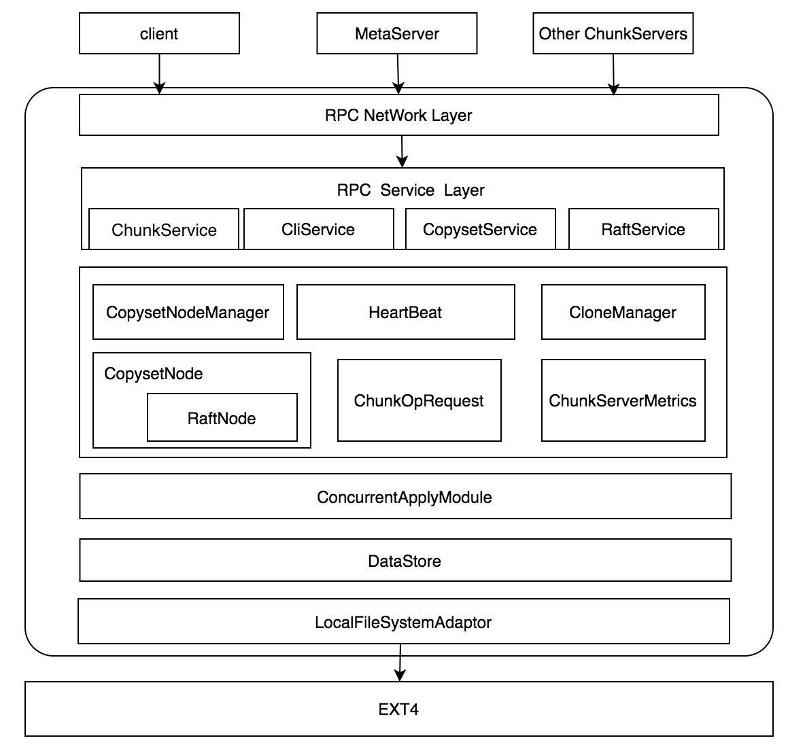
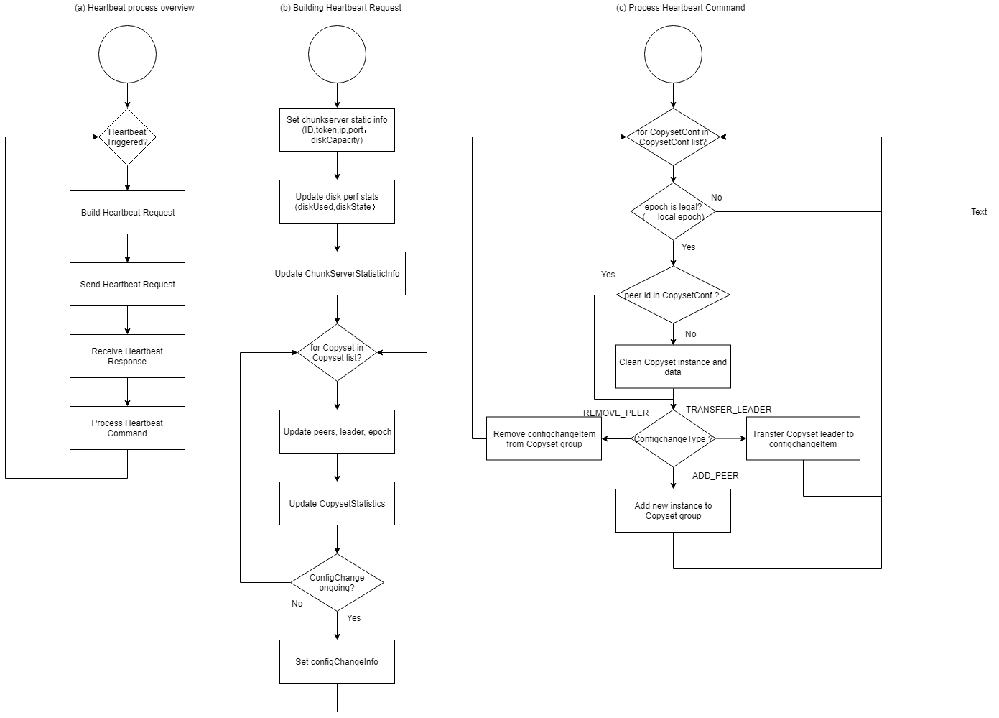
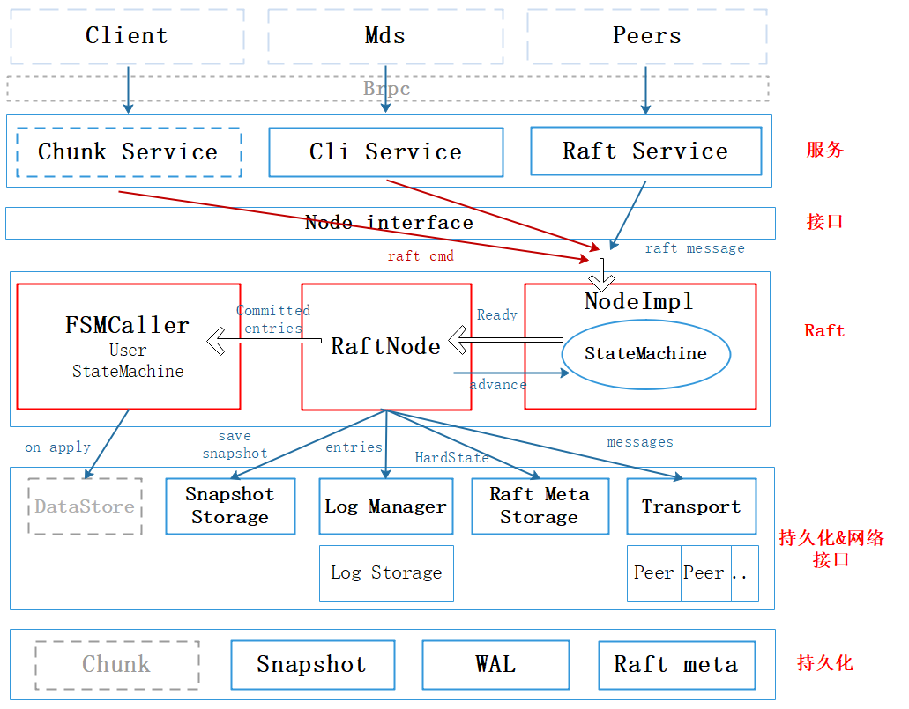

# CurveBS Chunkserver 架构介绍

## 1 ChunkServer 概述

### 1.1 设计背景

Curve存储秉承设计为支持各种存储场景的统一的分布式存储系统的目标，以高性能块存储为第一优先级，并逐步支持在线/近线对象存储，文件存储，大数据等各类场景。Curve ChunkServer承担了Curve存储的I/O路径的服务者角色，需要为各类存储存储场景提供优化的服务能力，极力提供更高的I/O性能，存储效率，可用性和可靠性。

### 1.2 系统概述

Curve ChunkServer遵照类GFS的分布式存储架构设计，是数据节点，对外提供数据I/O(读，写，快照等)和节点管理功能(获取Chunkserver的状态，统计信息，修改各模块的运行时参数和状态等)的对外接口，底层基于ext4存储引擎，并进行抽象封装。ChunkServer跟Client和MetaServer交互，高效地执行Client I/O，响应MetaServer的空间分配和调度，数据迁移和恢复，I/O服务质量，状态查询和用户控制等各类请求，并维护数据的可靠性和副本一致性。

### 1.3 设计目标

作为支持统一存储场景特别是高性能分布式块存储产品I/O路径的服务提供者，ChunkServer需要在性能，可用性，可靠性，易维护性等多方面表现优秀，包括：

- 高并发 	- 支持Client的高IOPS请求

- 低延时 	- Client I/O平均延时低，小于1ms

- 高容错 	- 在MDS的调度下，执行数据迁移和恢复, 并在此过程中保障I/O性能。容忍存储盘故障，保证集群数据存储整体的可靠性。

- 快照	- 支持Chunk级别的快照功能

- 热升级	- 可以针对集群进行在线升级，升级过程中ChunkServer集群可以继续不间断提供I/O服务

## 2 Chunk Server系统设计

### 2.1 总体架构

#### 2.1.1 设计理念

ChunkServer中用到了跟设计紧密相关的重要性理念，包括如下：

管理域 - ChunkServer的管理域为存储盘，每个数据服务器上有多块盘，每块盘对应一个ChunkServer实例，每个ChunkServer实例在OS上体现为一个用户态服务进程。不同的ChunkServer之间的隔离达到进程级别，单个ChunkServer的意外故障不会影响整台机器，单个存储盘不稳定或软件缺陷造成的性能问题也不会扩散到其他存储盘。

复制组(Copyset) - I/O数据块以复制组为处理单元进行副本复制和一致性处理，为了平衡故障恢复时间，负载均衡和故障隔离性，每块盘平均分布若干个复制组。每个复制组有一个主节点(Leader)和多个从节点(Follower)。Client端具有数据块对应的复制组信息，数据写发送到主节点，由主节点发送到从节点，收到从节点的响应后，主节点向Client返回操作结果。

异步I/O - ChunkServer从收到I/O请求开始到返回操作结果，路径上有网络数据收发，副本复制，事务写I/O等若干个相对耗时的处理逻辑。全同步的方式将造成这几个耗时的处理逻辑的串行化，通过异步化，增加整个链路的I/O并发性，可以对ChunkServer的处理能力大为提高。

线程池 - 由于每台数据服务器上存在大量的复制组数目和众多异步化I/O逻辑，I/O路径上需要大量的线程来进行并发处理，通过线程池来对这些线程进行生命周期管理，可以将具体逻辑从线程管理的负担中解放出来，同时复用线程生命周期，提供对服务器cpu架构更友好的亲和性，从而提高性能。

副本复制 - 多数副本同步复制，少数副本异步复制，避免少数慢盘影响性能

#### 2.1.2 软件架构

Chunk Server概要结构如下所示，通过网络消息收发层统一接收来自Client, MetaServer及其他ChunkServer的消息，不同类型的消息包括I/O请求，控制请求，以及事件通知，网络消息收发层通过RPC将不同的消息发送到服务层不同的子服务进行路由，子服务与Chunk Server中各个子系统相关联，包括I/O处理，快照，恢复，数据校验，配置，监控统计以及Chunk Server控制器等多个子系统，每个子服务包含一个接口集合，通过调用各个子系统中的不同功能提供服务。不同的子系统之间也可以通过对方的服务接口或内部接口进行相互协作。



各个功能子系统的功能和基本职责见下节功能子系统。

#### 2.1.3 功能子系统

+ RPC Service Layer

  提供chunkserver对外的rpc服务处理逻辑，包含的rpc服务包括

  - ChunkService

    处理chunkserver I/O 相关服务，是chunkserver的核心服务，包含读chunk、写chunk（创建chunk在写时创建）、删除chunk、读chunk快照、删除chunk快照、获取chunk信息、创建克隆chunk等等I/O相关功能。

  - CliService
  
    提供RAFT配置变更相关的rpc服务，包含AddPeer，RemovePeer，ChangePeer、GetLeader、ChangeLeader、ResetPeer等配置变更相关的服务。CliService底层通过调用Braft的配置变更相关接口完成配置变更。
  
  - CopySetService
  
    调用CopySetNodeManager创建CopysetNode，即创建Raft节点。在chunkserver集群初始化时，通过MetaServer调用该接口在各ChunkServer上创建Raft节点，并启动Raft节点的相关服务。
  
  - RaftService
  
    Braft的内置的RaftService，在chunkserver初始化时需要启动Raft对外的相关rpc服务。

+ Internal Service Layer
  
    - CopysetNodeManager

      负责管理CopysetNode即RaftNode的创建和删除管理。

    - HeartBeat

      心跳模块主要完成chunkserver对MetaServer定期上报心跳，使MetaServer感知chunkserver的存活性，感知chunkserver故障情况。同时心跳报文还负责上报chunkserver的各种状态、磁盘使用量等数据。

    - CloneManager

      CloneManager主要负责克隆相关的功能，内部是一个线程池，主要负责异步完成克隆chunk的数据补全。关于克隆相关的内容请参考[克隆快照文档](https://docs.opencurve.io/CurveBS/architecture/snapshot)。

    - CopysetNode

      CopysetNode封装了Raft状态机，是chunkserver的核心结构。

    - ChunkOpRequest

      ChunkOpRequest模块封装了对chunkservie到达的I/O请求的实际处理过程。

    - ChunkServerMetric

      ChunkServerMetric是对chunkserver所有Metric的封装，负责采集chunkserver内部的各种metric，结合外部Prometheus和Graphna，方便的展示chunkserver内部的各项数据指标，方便观测和诊断chunkserver的各种问题。

+ ConcurrentApplyModule

  并发控制层，负责对chunkserver的IO请求进行并发控制，对上层的读写请求安照chunk粒度进行Hash，使得不同chunk的请求可以并发执行。

+ DataStore

  DataStore是对chunk落盘逻辑的封装。包含chunkfile的创建、删除，以及实际对chunk的读写，chunk基本cow的快照，克隆chunk的管理等等。

+ LocalFileSystermAdaptor

  LocalFileSystermAdaptor是对底层文件系统的一层抽象，目前适配封装了ext4文件系统的接口。
  之所以要做这层抽象，目的是隔离了底层文件系统的实际读写请求，如果将来curve要适配裸盘或者采用其他文件系统，可以在这层进行适配。

### 2.2 关键模块

#### 2.2.1 chunkserver初始化

##### chunkserver注册

Chunkserver需要通过注册来加入一个Curve集群，并得到MDS分配的Chunkserver ID作为集群内的唯一合法标识，并需要在后续的通讯中提供此ID和token作为身份标记和合法性认证信息。

Chunkserver注册使用首次注册的模式。在首次启动时向MDS发送包含Chunkserver基本信息的注册消息，使MDS新增一条Chunkserver信息记录和调度对象，MDS向Chunkserver返回的消息中包含分配给此Chunkserver的ID作为此Chunkserver在集群中的唯一身份标志。后续Chunkserver启动或重启时，不再向MDS进行注册。

Chunkserver在启动时，流程如下：

+ 检测本地Chunkserver对应存储盘上的Chunkserver ID, 如果存在，说明注册过，直接跳过后续步骤；

+ 构造ChunkServerRegistRequest消息，使用RegistChunkServer接口发送给MDS；

+ 如果响应超时，或表示MDS暂时不可用，返回到步骤2进行重试；如果statusCode表示无效注册等含义，chunkserver退出

+ 将chunkserverID和token持久化到盘上，注册完毕

##### chunksever注册信息的持久化：

chunkserver注册信息持久化的格式根据不同的存储引擎而不同，对于目前Ext4存储引擎, Chunkserver持久化信息保存在数据主目录下的chunkserver.dat文件中。
存储时，计算Chunkserver ID，token和数据版本号相关的checksum，构成ChunkserverPersistentData，以json的数据格式，写入到chunkserver.dat文件中。
读取时，获取的ChunkserverPersistentData数据首先校验校验码，防止读取到损坏的数据，并确认版本号是支持的版本。

##### Chunkserver Copyset重建

Chunkserver在重启时，需要重建在重启前已经分配过的Copyset，以响应来自Client/MDS端针对这些Copyset的访问。

由于Copyset被创建时和初始化时，会在数据主目录下创建copyset子目录，因而留下持久化信息，如1.4节所示。所以可以根据copyset目录列表，得到已经分配的Copyset列表；由于braft本身持久化了raft configuration，所以如果使用相同的copyset数据目录，braft可以自动从持久化信息中恢复出raft configuration。因此Copyset的持久化数据，可以全部从Chunkserver的本地存储盘获取。

Chunkserver启动时，通过扫描数据主目录下的"LogicPoolId/CopysetId"子目录列表，以获得Chunkserver已经创建的的Copyset列表，根据子目录名字的格式，可以解析出来poolId, 和copysetId，然后使用空的raft configuration可以重建Copyset实例，Copyset重建后，由于使用相同的raft各类数据目录，braft可以从snapshot meta中自动恢复出raft configuration出来，加载snapshot和log, 完成初始化。

#### 2.2.2 HeartBeat

MDS需要实时的信息来确认Chunkserver的在线状态，并得到Chunkserver和Copyset的状态和统计数据，并根据信息下发相应的命令。
Chunkserver以心跳的方式来完成上述功能，通过周期性的心跳报文，更新Chunkserver和Copyset的信息，反馈上一个心跳周期的命令执行结果，并接受，解析和执行新的心跳响应报文。

Chunkserver通过心跳消息定期向MDS更新Chunkserver信息，Copyset状态信息，磁盘状态信息，配置变更命令执行状态等信息，MDS收到请求后，根据调度逻辑将新的copyset配置变更命令添加到消息响应中。

心跳流程详细流程图：



#### 2.2.3 CopysetNode

CopysetNode封装了RaftNode的状态机，是chunkserver的核心模块，其总体架构如下图所示：




- Node Interface

整个curve-raft对用户暴露的接口，主要提供给用户`Propose` task给raft statemachine处理

- raft层

主要是核心处理逻辑的模块

（1）NodeImpl主要：

1. 接收来自外部的Request，然后通过 Raft statemachine `RawNode`的接口提交给状态机处理，而且其会拥有一个独立`Propose execqueue`负责驱动Raft statemachine运转，并输出中间结果`Ready`
2. 而且是`Node Interface`的实际实现者，除此之外，还包含了处理Tick timeout和InstallSnapshot的逻辑。

（2）RaftNode

主要是处理Raft StateMachine的输出的中间结果`Ready`，包括异步处理`Ready`的exec queue。包含需要转发给其他Peers的Msg，需要落盘的Op log entries，以前需要Apply的committed entries

（3）FSMCaller

负责User StateMachine的具体执行逻辑，也就是State Machine Apply的逻辑，会包含相应的Apply bthread异步batch的处理需要Apply的请求。

- 持久化&网络接口

（1）Snapshot Storage：负责snapshot meta和snapshot read/write接口

（2）LogManager：Op Log日志管理者，包含Op Log的读写接口，还有Log落盘的batch控制，Op Log缓存等。实际的Op Log最基本的读写接口还是依赖LogStorage的实现。

（3）Raft Meta Storage：raft meta（term,vote，也就是HardState）的持久化

（4）Transport：负责管理复制组Peers的连接，提供message send和peers链接管理的接口

#### 2.2.4 ChunkFilePool

ChunkFilePool位于DataStore层，Chunkserver使用基于ext4实现的本地文件系统，由于写操作存在较大的IO放大，因此在创建chunk文件时会调用fallocate为文件预分配固定大小的空间，但是即便fallocate以后，在写文件未写过的块时仍需要更改元数据，存在一定的IO放大。
curve使用的一种优化方案是直接使用覆盖写过一遍的文件。由于chunkserver上的所有chunk文件和快照文件都是相同固定大小的文件，所以可以预先生成一批被覆盖写过的固定大小文件，创建chunk文件或快照文件时直接从预分配的文件池中获取进行重命名，删除chunk文件或快照文件时再将文件重命名放到预分配池中，这个预分配池就是chunkfile-pool。

chunkserver目录结构：

```
chunkserver/
	copyset_id/
				data/
				log/
				meta/
				snapshot/
	...
	
	chunkfilepool/
				chunkfile_xxx_tmp
				chunkfile_xxx_tmp
				...
```

+ 系统初始化阶段：分配一定数量的chunk文件，这个预分配数量是可配置的，当系统重启的时候需要遍历chunkfilepool 目录，将还未分配出去的tmp chunk信息收集在对应的vector池子中，供后续查询使用。
+ GetChunk接口从chunkpool池子中取出一个闲置的chunk，如果池子里没有闲置的文件了，那么同步创建文件，如果池子的水位到达低水位，那么发起一个异步任务进行异步文件分配。
+ 文件分配的操作基于的是文件系统的rename，rename操作可以保证原子性，因此保证了创建文件的原子性。
+ 回收chunk：当外部删除chunk的时候，需要回收chunk，并将chunk置位。回收chunk避免了重新分配