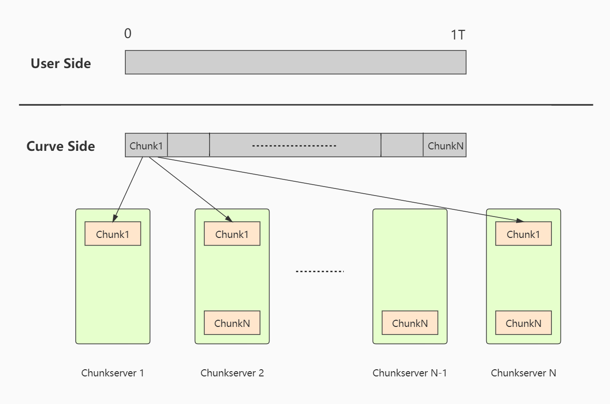
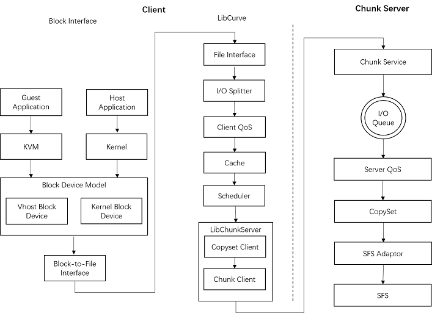
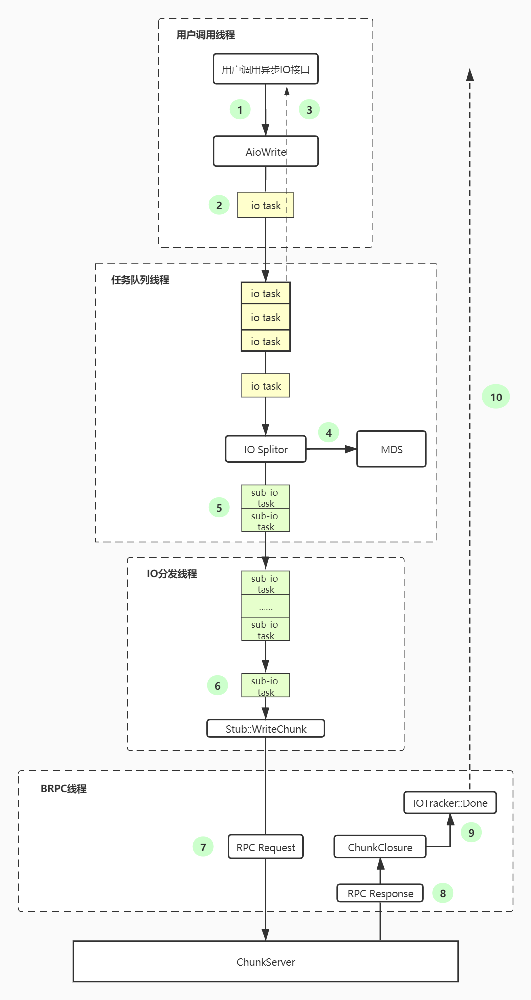

# CurveBS Client 架构介绍

## 1 概要

curve作为中心化的分布式存储系统主要组件分为前端驱动Client模块、底层存储Chunkserver模块、元数据服务器MDS模块，以及快照系统。

所谓前端驱动client模块即为curve client，它以动态库libcurve的方式向上提供服务，外部服务进程如Qemu、Curve-Nbd通过链接该库来使用curve提供的存储服务。（热升级后，curve client不再直接对接Qemu和Curve-Nbd等上层服务。）

所以，curve client可以理解为用户行为入口。

## 2 curve client功能点

Curve Client存在的目的就是通过提供接口的方式向上提供用户数据存储服务，curve系统以分布式文件系统作为底层存储向上提供块存储服务。从用户角度来看，curve为其提供的就是一个可以进行随机读写的块设备，这个块设备对应的就是底层curvefs的一个文件。

这个curvefs文件的底层存储方式是分布在多个底层集群节点上的，举个例子：

用户创建一个1T的块设备，这个块设备在底层curvefs上就是一个1T大小的文件。如下图：

> 注意：这个所谓的1T大小的文件只是一个逻辑概念，这个文件只有curve client和mds两个模块感知，底层存储集群chunksevrer节点不感知这个文件。

用户一侧创建一个1T的块设备，对其而言是一个连续的0-1T的连续地址空间，其可以在这个空间内进行随机读写。但是从curve角度来看，这个1T大小的块设备就是一个由一批chunk组成的地址空间，每个chunk有唯一的ID编号，这些chunk会对应到底层chunkserver上一段真实的物理存储空间。

curve client与底层存储集群以rpc方式通信，因此curve client的功能点也就呼之欲出。

### 2.1 提供接口

用户创建块设备及读写块设备都是通过curve client提供的接口，这些接口包括创建块设备、打开块设备等等，以及读写该块设备，为了追求极致的性能，curve向上提供异步读写接口。

### 2.2 IO拆分

从上图可以看到，用户的块设备其实在底层物理存储中是以chunk为单位打散在底层多个存储节点上的，这一方面可以提供处理的并发度，同时也能够提高数据的可靠性。

用户写数据到curve client，client能够拿到用户IO的offset、length、data，这个offset + length在curve的文件上有可能会覆盖多个chunk，因为底层chunk是分布在不同的chunkserver上的，所以curve client需要把用户对块设备的的IO请求，转换为对底层不同chunkserver的chunk请求，并分别下发。

### 2.3 IO跟踪

IO拆分会将用户的IO根据offset和length拆分，比如一个用户的IO `offset = 0， length = 2*chunksize`，那么这个请求到client后，会被至少拆分成两个请求，因为这个IO正好横跨两个chunk，这两个chunk分布在不同的chunkserver上，因此一个大IO被拆分成了两个小IO，由于client的IO接口是异步的，而且client写chunk也是异步的，所以需要跟踪一个大IO的每个子IO，记录其返回状态，只有所有的子IO都返回这个IO才能算完成，然后才能向上返回给用户。

### 2.4 元数据获取及缓存

curve client本身是一个无状态的组件，不会保存文件的任何元数据信息，上面提到的IO拆分，是需要依据的，client需要知道chunk对应到具体chunkserver上的某一个物理chunk。这些信息都是通过mds获取的，mds会持久化文件的路由信息，当用户写某个块设备时，client需要从mds获取这个文件的元数据信息，然后保存在内存，供后续使用。

一个用户IO下发需要的元信息：

1. 上层文件与底层chunk的对应关系，即上层文件的逻辑chunk，与底层物理chunk的对应关系
2. 底层物理chunk所属的raft group
3. raft group所在的chunkserver列表

### 2.5 mds failover 支持

mds提供元数据存储服务，为了提高可用性，mds以集群方式服务，同一时刻只有一个mds提供服务，其他mds节点通过etcd进行监听，随时准备替代leader，成为新leader提供服务。

curve client在IO下发及控制面调用时会与mds进行通信，通信以RPC方式进行，通信时需要指定对应的mds的地址，所以如果mds集群中服务节点切换时还需要client进行地址切换。

### 2.6 Chunkserver failover 支持

与mds高可用设计类似，chunkserver存储节点通过使用raft算法，实现多节点数据复制及高可用保证，在curve client一侧下发请求时需要先获取当前raft group的leader，然后将请求发往leader所在的节点。

### 2.7 IO流控

所谓IO流控就是curve client在感知底层集群负载过高时进行一定的流量控制，防止底层负载恶性循环。从本质上讲，client一侧的IO流控只是一种缓解方式，并非一种根本解决方案。

## 3 curve client架构

上节大致描述了client的功能点，本节分析client的架构，主要从模块架构和线程模型两方面。

### 3.1 模块架构

curve client的基本模块架构如下，其中client qos目前暂未实现

### 3.2 线程模型

这里以异步IO请求为例，client一侧共涉及到4类线程：

1. 用户线程：用户发起异步IO请求，会调用client的AioWrite接口，AioWrite会将用户请求封装成task放入任务队列中，此时用户调用就返回了。
2. 任务队列线程：任务队列线程会监听任务队列，只要有任务进来，就从队列中取出，进行IO拆分，拆分成的Sub-IO请求会放入IO分发队列中。
3. IO分发线程：根据Sub-IO的信息，调用RPC发送异步请求到对应的chunkserver节点。
4. BRPC线程：RPC的发送以及请求的返回都是在BRPC线程中处理的，rpc返回后还会调用异步请求的Closure回调。如果所有的Sub-IO都返回成功，则会找到对应的上层IO请求，并调用异步IO的回调（回调的操作也是在BRPC线程中执行）。

## 4 关键点

### 4.1 MetaCache

IO拆分过程中，需要依赖文件的元数据信息，这些元数据信息在client一侧并不持久化，只是在需要的时候从mds获取。

为了避免频繁与mds通信，client会对获取到的元数据进行缓存。

缓存的元数据在2.4节已经提到，主要是以下几点：

1. file chunk -> chunk id：上层文件与底层chunk的对应关系，即上层文件的逻辑chunk，与底层物理chunk的对应关系
2. chunk id -> copyset id(raft group)：底层物理chunk所属的raft group
3. copyset id -> serverlist：raft group所在的chunkserver列表

#### 4.1.1 元数据缓存更新

通常文件一旦分配了对应的chunkid和copysetid，这些信息就不会变化。

上述三种元数据会出现更新的就是copysetid到serverlist的映射关系。因为底层如果出现节点宕机、负载不均衡等情况会触发配置变更，这种情况下会导致copyset的chunkserver列表发生变更。

client触发元数据更新都是通过RPC失败。

更新的元数据信息包括

1. raft group的leader信息

   client发送请求是发送到raft group leader节点，在每次发送请求之前都会获取当前raft group的leader信息（metacache进行缓存）。

   请求发送到chunkserver之后，如果这个chunkserver已经不是leader了，那么**client会发起GetLeader请求到当前raft group里的其他chunkserver节点**。因为如果底层重新选举出了leader，节点肯定知道当前leader是谁，然后会把这个信息返回给client，client更新完metacache中的leader信息之后将请求转发到新leader。

2. raft group的peer信息

   极端状况下，某个raft group因为底层节点宕机等原因，其group peer全部变更了。这种情况下，通过GetLeader是无法获取真正的leader信息，所以在重试多次之后client会向mds拉取当前raft group的最新信息。

### 4.2 IO请求重试

IO分发线程获取IO任务后会发送异步RPC请求，RPC请求返回后，会调用异步请求的回调。在回调中，会根据RPC请求的返回值，判断请求成功与否。如果请求失败，而且需要进行重试，那么会在回调中再次发起rpc请求。

> 对于读写请求，重试次数设置很大，目的在于让IO尽可能成功返回。因为对于块设备而言，如果用户写入返回错误会造成上层认为块设备错误，硬盘损坏。

RPC请求重试时，会进行预处理，分为两种情况：

1. chunkserver overload

   这种情况下，对应的RPC Response中返回的错误码是OVERLOAD，说明底层chunkserver目前负载较高。

   此时，如果直接发送重试请求，大概率的情况下还是会返回OVERLOAD。所以这种情况下，应该让client在下发重试请求前，一段时间的sleep。

   在client一侧，针对这种情况，加入了睡眠重试时间指数退避，并加入了睡眠时间随机抖动，避免大量请求同时被返回OVERLOAD后，又同时重试。

2. RPC Timeout

   出现这种情况的原因比较多，但是常见的原因是，底层chunkserver处理请求较多，压力较大，导致请求的返回时间超过了预期的RPC超时时间。

   这种情况下，如果重试请求的RPC超时时间不发生变化，那么很可能会重复上述流程，导致用户IO请求迟迟未能返回。所以，在这种情况下，重试请求会将RPC超时时间进行增加。