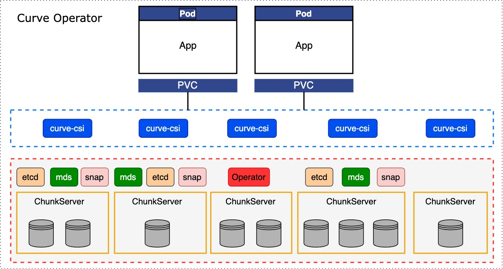

# 使用 Curve Operator 在 Kubernetes 上部署 CurveFS 集群

`curve-operator`代码仓库：https://github.com/opencurve/curve-operator/blob/master/docs/readme_cn.md

## 简介

Curve-Operator用于管理 [Kubernetes](https://kubernetes.io/docs/home/) 系统上的 [Curve](https://github.com/opencurve/curve) 集群。更进一步地支持Curve实现云原生的分布式存储系统。



## 部署

### 0. 先决条件

* 安装Kubernetes1.19/1.20版本。

### 1. 安装Operator

首先需要安装Curve Operaotr，然后再部署 Curve 集群。

```shell
$ git clone https://github.com/opencurve/curve-operator.git
$ cd curve-operator
$ kubectl apply -f config/deploy/
```

安装成功后，默认会创建`curve` namespace，确认curve-operator处于Running状态。

```shell
$ kubectl get pod -n curve
NAME                              READY   STATUS    RESTARTS   AGE
curve-operator-69bc69c75d-jfsjg   1/1     Running   0          7s
```

### 2. 部署Curve集群

Operator部署集群基于声明式的API，你可以在这个目录 [config/sample](https://github.com/opencurve/curve-operator/tree/master/config/samples) 下找到所有的声明式yaml例子。并且可以自定义修改从而能够符合你当前的部署环境。

[CurveBS 单机部署](https://github.com/opencurve/curve-operator/blob/master/config/samples/bscluster-onehost.yaml)

[CurveBS 三副本部署](https://github.com/opencurve/curve-operator/blob/master/config/samples/cluster.yaml)

[CurveFS 单机部署](https://github.com/opencurve/curve-operator/blob/master/config/samples/fscluster-onehost.yaml)

[CurveFS 三副本部署](https://github.com/opencurve/curve-operator/blob/master/config/samples/fscluster.yaml)

这里我们以部署三副本的 `CurveBS` 集群为例进行说明。这里的声明文件是[cluster.yaml](https://github.com/opencurve/curve-operator/blob/master/config/samples/cluster.yaml)。你可以根据yaml文件中的注释详细的了解每一个配置项的作用，从而自定义修改。

输入如下命令创建集群:

```shell
$ kubectl apply -f config/samples/cluster.yaml
```

查看当前 `curve` namespac 下的所有的pod：

```shell
$ kubectl -n curve get pod

NAME                                                          READY   STATUS      RESTARTS   AGE
curve-chunkserver-curve-operator-node1-vdc-556fc99467-5nx9q   1/1     Running     0          5m45s
curve-chunkserver-curve-operator-node2-vdc-7cf89768f9-hmcrs   1/1     Running     0          5m45s
curve-chunkserver-curve-operator-node3-vdc-f77dd85dc-z5bws    1/1     Running     0          5m45s
curve-etcd-a-d5bbfb755-lzgrm                                  1/1     Running     0          41m
curve-etcd-b-66c5b54f75-6nnnt                                 1/1     Running     0          41m
curve-etcd-c-86b7964f87-cj8zk                                 1/1     Running     0          41m
curve-mds-a-7b5989bddd-ln2sm                                  1/1     Running     0          40m
curve-mds-b-56d8f58645-gv6pd                                  1/1     Running     0          40m
curve-mds-c-997c7fd-vt5hw                                     1/1     Running     0          40m
gen-logical-pool-rzhlz                                        0/1     Completed   0          5m15s
gen-physical-pool-chnw8                                       0/1     Completed   0          5m45s
prepare-chunkfile-curve-operator-node1-vdc-znb66              0/1     Completed   0          40m
prepare-chunkfile-curve-operator-node2-vdc-6gf2z              0/1     Completed   0          40m
prepare-chunkfile-curve-operator-node3-vdc-2bkxm              0/1     Completed   0          40m
read-config-k272k                                             0/1     Completed   0          41m
```

> 说明：在执行完apply命令之后，通过get命令你可以不能立刻就能看到`chunkserver` pods。因为磁盘需要进行格式化，这个格式化的过程是通过`prepare-chunkfile` jobs去完成的。所以可能会等待一段时间之后才会看到所有的`chunkserver` pods。
>
> 具体的等待时间需要根据你的磁盘的大小以及你定义的格式化的百分比，这个时间可能会很长。你可以通过日志查看格式化的进程。

### 3. 检查集群的健康状态

为了检查部署的集群是否是健康的，需要进入任何一个`curve-chunkserver` pod，然后使用`curve_ops_tool status` 去查看集群的健康状态。

```shell
$ kubectl exec -it <any one chunkserver pod> -- bash
$ curve_ops_tool status

Cluster status:
cluster is healthy
total copysets: 100, unhealthy copysets: 0, unhealthy_ratio: 0%
physical pool number: 1, logical pool number: 1
Space info:
physical: total = 1178GB, used = 6GB(0.56%), left = 1171GB(99.44%)
logical: total = 392GB, used = 41GB(10.44%, can be recycled = 0GB(0.00%)), left = 351GB(89.56%), created file size = 60GB(15.28%)

Client status:
nebd-server: version-1.2.5+2c4861ca: 1
...
```

##  Curve CSI

在Kubernetes系统中，需要创建PVC从而使用 `Curve` 作为pod的后端存储。

你可以部署对接 Curvebs 集群的 [curve-csi](https://github.com/opencurve/curve-csi) 或者是对接 Curvefs 集群的 [curvefs-csi](https://github.com/opencurve/curvefs-csi)。如何部署以及具体的实现细节可以参考对应的项目文档。

## 删除

为了删除已经部署的Curve集群并且清楚其中的数据，可能需要经历如下步骤。

### 1. 删除集群CR

```shell
$ kubectl -n curve delete curvecluster my-cluster
```

为了验证cluster CR已经被删除，你可以通过如下命令查看：

```shell
$ kubectl -n curve get curvecluster
```

### 2. 删除Operator以及相关的资源

```shell
$ kubectl delete -f config/deploy/
```

### 3. 删除持久化在宿主机的数据和日志（慎重）

为了彻底的清除集群，需要把集群中的数据和日志全部清除。这个目录是在`cluster.yaml`文件中定义的`hostDataDir`配置项。注意，在部署新集群之前一定要将这个配置目录下的内容删除。

对于多副本部分的集群，数据分布在各个集群节点上，所以需要登录各个节点进行删除。例如，如果配置的目录是`/curvebs`的话，则需要删除这个目录下的所有数据和日志：

```shell
rm -rf /curvebs
```
